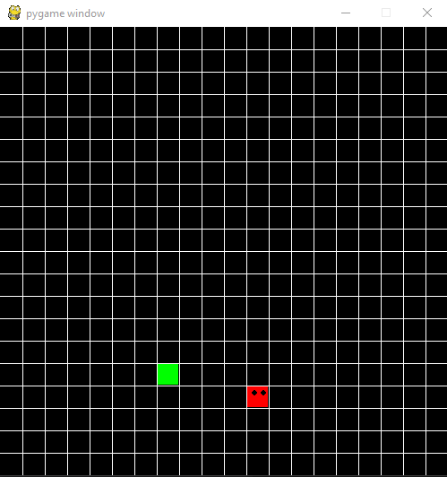

# PythonSnake

Snake game written in Python

## Getting Started

Before you clone the repository you first want to make sure you have [Python3](https://www.python.org/downloads/). Also make sure you have pygame installed as well.

`pip3 install pygame`

Once pygame is downloaded you can then clone.

`git clone https://github.com/Googlymonster/PythonSnake.git`

To run the game enter the following code in the terminal.

`python3 snake.py`

To move the snake around use the "wasd" keys.

### Have Fun

